# Evasión de la protección PatchGuard en Windows

**Autor:** José Luis Galán DOs Reis Pereira
**Módulo:** Ingeniería inversa en sistemas operativos Windows
**Fecha:** 30/06/2026
**Repositorio:** https://github.com/JoseLuisGalan/Analisis-de-PatchGuard-en-windows.git

---

## Índice

1. [Introducción](#1-introducción)
2. [Contexto: la era dorada del malware avanzado](#2-contexto-la-era-dorada-del-malware-avanzado)
    - 2.1  Evolución de las amenazas en modo kernel
    - 2.2 El ecosistema de protecciones de Windows
    - 2.3 El papel de PatchGuard dentro de ese ecosistema
3. [Fundamentos de PatchGuard / KPP](#3-fundamentos-de-patchguard--kpp)
   - 3.1. ¿Qué es y por qué existe?
   - 3.2. Estructuras y código protegido
   - 3.3. Modelo de funcionamiento asíncrono
4. [Internals: inicialización y mecanismos internos](#4-internals-inicialización-y-mecanismos-internos)
   - 4.1. Localización de la rutina de inicialización
   - 4.2. Comprobaciones iniciales (modo seguro, debugger adjunto)
   - 4.3. Ofuscación de contextos y nombres de símbolos engañosos
   - 4.4. Cadena de notificación de fallos (KeBugCheckEx → KeBugCheck2 → BSOD)
5. [Evolución histórica de las técnicas de bypass](#5-evolución-histórica-de-las-técnicas-de-bypass)
   - 5.1. 2005 — skape & Skywing: el paper fundacional
   - 5.2. 2017 — GhostHook (abuso de Intel PT)
   - 5.3. 2019 — InfinityHook 
   - 5.4. 2019 — ByePg
6. [HyperGuard / Secure Kernel Patch Guard: la respuesta a largo plazo](#6-hyperguard--secure-kernel-patch-guard-la-respuesta-a-largo-plazo)
7. [Conclusiones](#7-conclusiones)
8. [Referencias](#8-referencias)

---

## 1. Introducción

En este repositorio se resumirá en detalle el funcionamiento de PatchGuard. Desde un intento para que sea comprensible para la gran mayoría. 

Los apartados que se abordarán será desde sus origenes, funcionalidades, su relevancia en el mundo de la seguridad como el malware y un analisis de su estructuras internas como funcionamiento. 

El objetivo principal es que el lector tenga un conocimiento accesible como estructurado de esta mitigación y de como en la historia se ha ido mitigando.

## 2. Contexto: la era dorada del malware avanzado

En esta sección se hará un repaso historico de como el malware a nivel de kernel ha amenazado el sistema y como se han ido desarrollando estructuras como mecanimos para su detección formando el ecosistema que está a día de hoy

## 2.1  Evolución de las amenazas en modo kernel

A comienzos de los 2000, el modelo de seguridad de Windows en x86 permitía que los controladores (drivers) operaran con el mismo nivel de privilegio que el propio núcleo, sin que el sistema impusiera restricciones reales sobre qué estructuras internas podían modificar. Los controladores de dispositivo tenían el mismo nivel de privilegio que el propio kernel, y se esperaba que no modificaran ni parchearan estructuras centrales del sistema, pero en las ediciones x86 Windows no imponía esa restricción. Esto dio lugar a la práctica conocida como "kernel patching", utilizada tanto por fabricantes de antivirus legítimos como por autores de malware. 

Algunas aplicaciones de seguridad usaban kernel patching para identificar y bloquear código malicioso, monitorizando el sistema en busca de modificaciones a estructuras del kernel; el problema es que esa misma técnica fue adoptada también por desarrolladores de malware para conseguir persistencia y ocultación a nivel de sistema. Esta etapa, situada aproximadamente entre finales de los 90 y mediados de los 2000, suele describirse como el origen de los rootkits modernos en modo kernel: programas capaces de alterar estructuras como la tabla de servicios del sistema (SSDT) para esconder procesos, archivos o conexiones de red ante las herramientas de monitorización del propio sistema operativo.

La proliferación de antivirus y, en paralelo, de malware que dependía de las mismas técnicas de bajo nivel llevó a Microsoft a una decisión arquitectónica relevante con la llegada de las ediciones de 64 bits: dejar de tolerar el parcheo del núcleo como práctica aceptable, incluso para fines defensivos.
## 2.2 El ecosistema de protecciones de Windows

A partir de Windows Vista y, sobre todo, de Windows 8 y 10, Microsoft fue construyendo capas sucesivas de defensa en el arranque y en el núcleo, cada una respondiendo a una generación distinta de amenazas:

Driver Signature Enforcement (DSE), introducido junto con las ediciones x64, exige que todo controlador cargado en modo kernel esté firmado digitalmente por un certificado de confianza, cerrando la puerta a la carga directa de drivers maliciosos no firmados.

Secure Boot, parte de la especificación UEFI adoptada por Microsoft desde Windows 8, verifica la cadena de firmas del firmware, el gestor de arranque y el propio kernel antes de ceder el control al sistema operativo, dificultando los ataques que buscaban manipular el proceso de arranque para cargar código no autorizado antes de que las protecciones del sistema operativo entraran en juego (los llamados bootkits).

Virtualization Based Security (VBS) y su componente HVCI (Hypervisor-protected Code Integrity), introducidos con Windows 10, llevaron la protección un paso más allá al apoyarse en el hipervisor: en lugar de confiar exclusivamente en mecanismos software dentro del propio kernel, parte de la verificación de integridad se traslada a un nivel de privilegio (VTL1) inaccesible incluso para código que se ejecuta con privilegios de kernel convencionales. Microsoft trasladó la capa de aplicación a lugares que un driver de kernel normal simplemente no puede tocar: protecciones hardware-enforced y respaldadas por el hipervisor. 

Control Flow Guard (CFG), por su parte, se centra en mitigar una clase distinta de ataques: los que abusan del flujo de ejecución del programa (por ejemplo, mediante corrupción de memoria) para saltar a ubicaciones de código arbitrarias.

Cada una de estas tecnologías nació como respuesta a una técnica de ataque concreta que se había vuelto común en la generación anterior de amenazas, formando capas sucesivas que se complementan entre sí en lugar de sustituirse.

## 2.3 El papel de PatchGuard dentro de ese ecosistema
PatchGuard, formalmente Kernel Patch Protection (KPP), es una característica de las ediciones de 64 bits de Windows que impide el parcheo del núcleo, introducida por primera vez en 2005 con las ediciones x64 de Windows Vista y Windows Server 2003 Service Pack 1 (otras fuentes sitúan su primer despliegue ya en abril de 2005 con Windows XP x64 y Windows Server 2003 SP1 x64, antes incluso del lanzamiento de Vista). Su implementación inicial formó parte de la transición a Windows de 64 bits, integrándose en el núcleo específicamente para combatir las tácticas de evasión de rootkits prevalentes en esa época. 

A diferencia de Secure Boot o DSE, que actúan en el momento de arranque o de carga, PatchGuard opera de forma continua durante la ejecución del sistema: funciona comprobando periódicamente que las estructuras del sistema protegidas en el kernel no hayan sido modificadas, y si detecta una modificación, Windows provoca un bug check y apaga el sistema, mostrando una pantalla azul y/o reiniciando. Esto la convierte en la pieza del ecosistema orientada específicamente a la integridad en tiempo de ejecución del propio núcleo, complementando a las protecciones de arranque (Secure Boot) y de carga de código (DSE), que actúan en momentos anteriores del ciclo de vida del sistema. 

Su introducción no estuvo exenta de controversia. Compañías de seguridad como McAfee y Symantec sostuvieron que, al ser una defensa imperfecta, los perjuicios causados a los proveedores de seguridad superaban los beneficios, ya que el software malicioso encontraría formas de evadirla mientras el software de seguridad legítimo perdía libertad de acción para defender el sistema, y en 2006 la Comisión Europea llegó a expresar su preocupación por considerar que la medida era potencialmente anticompetitiva.

Con el paso de los años, PatchGuard fue evolucionando en sucesivas versiones (Vista, Windows 7, Windows 8.1, etc.), cada una respondiendo a generaciones de bypasses descubiertos por la comunidad de investigación, hasta la incorporación de HyperGuard / Secure Kernel PatchGuard (SKPG) en sistemas con VBS/HVCI habilitado, que traslada parte de esa vigilancia a un nivel de privilegio superior al del propio kernel tradicional. HyperGuard actúa como el vigilante del hipervisor, ejecutándose en VTL1 y monitorizando constantemente las estructuras críticas del hipervisor y de VTL1 en busca de manipulaciones, funcionando como "el protector de un protector". Esta evolución ilustra cómo PatchGuard pasó de ser una solución aislada en software a integrarse dentro de un modelo de seguridad multicapa apoyado en hardware y virtualización. 

## 3. Fundamentos de PatchGuard / KPP

En este apartado se centrará ya en la explicación de PatchGuard. Desde sus estructuras hasta su funcionamiento en bajo nivel. Desde una defición menos generalista hasta su funcionamiento sin entrar en nada interno, para ello está el punto 4. 

### 3.1. ¿Qué es y por qué existe?

KPP es una mitigación que se introdujo en 2005, cuyo unico proposito es la inspección de estructuras criticas del nucleo. Con ello, solo busca que el sistema sea congruente en todo momento.

Un añadido notorio, es que se encuentra en anillo 0, es decir, no requiere de más persmisos para su funcionamiento. 

En caso de encontrar una anomalía en las estrcutura que se observan, lanza un pantallazo azul y da el error CRITICAL_STRUCTURE_CORRUPTION 0x109

### 3.2. Estructuras y código protegido

Las estructuras que protege son las siguientes:

- IDT
- GDT
- MSR
- SSDT
- Pilas de nucleo
- Estrcuturas del nucleo
- Variables globales
- Motor KPP:

### 3.2.1 GDT
Es una estructura que usa la CPU para saber sobre los segmentos de memoria. El descritpor de esta estructura es la siguiente:
- Size: determina el tamaño de la tabla, siendo el valor maximo 65535 y minimo 1.
- Desplazamiento: la dirección lineal de la GDT.

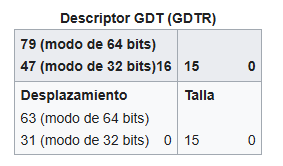

La tabla posee las siguientes entradas, distinguendose la dirección y el contenido.  Esta tabla sigue el siguiente orden:
- La primera dirección siempre es nula, solo son usables las siguientes.
- Las entradas de las tablas solo se puede acceder mediante selectores de segemento. Se cargan en los registros.
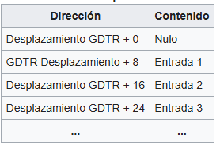

Cada elemento de la tabla tiene la siguiente estructura:
- Base:  Un valor de 32 bits que contiene la dirección lineal donde comienza el segmento.
- Limite: Un valor de 20 bits indica la unidad máxima direccionable, ya sea en unidades de 1 byte o en páginas de 4KiB. Por tanto, si eliges la granularidad de página y fijas el valor límite en 0xFFFFF el segmento cubrirá todo el espacio de direcciones de 4 GiB en modo de 32 bits

En 64 se ignorar estos dos valores, porque cada descriptor ocupa todo el espacio de direcciones lineales.

Ahora pasemos los bytes de acceso, habiendo un total de 7 modos en esos 8 bytes

- P: parte del presente. Permite que una entrada se refiera a un segmento válido. Debe establecerse (1) para cualquier segmento válido.
- DPL: campo de nivel de privilegio del descriptor. Contiene el nivel de privilegio de CPU del segmento. 0 = privilegio más alto (núcleo), 3 = privilegio más bajo (aplicaciones de usuario).
- S: tipo descriptor de la partida. Si está claro (0), el descriptor define un segmento del sistema (por ejemplo, un segmento de estado de tarea). Si se establece (1), define un segmento de código o de datos.
- E: parte ejecutable. Si está claro (0), el descriptor define un segmento de datos. Si se establece (1), define un segmento de código que puede ejecutarse desde 
- DC: bit de dirección/Bit conforme.
    - Para selectores de datos: bit de dirección. Si está claro (0), el segmento crece. Si se establece (1), el segmento crece hacia abajo, es decir, el Desplazamiento debe ser mayor que el Límite.
    - Para selectores de código: bit conforme.
        - Si el código (0) limpio en este segmento solo puede ejecutarse desde el anillo establecido en DPL
        - Si se establece (1), el código en este segmento puede ejecutarse desde un nivel de privilegio igual o inferior. Por ejemplo, el código en el anillo 3 puede saltar mucho a código conforme en un segmento del anillo 2. El campo DPL representa el nivel de privilegio más alto permitido para ejecutar el segmento. Por ejemplo, el código en el anillo 0 no puede saltar mucho a un segmento de código conforme donde DPL es 2, mientras que el código en anillos 2 y 3 sí puede. Ten en cuenta que el nivel de privilegio sigue siendo el mismo, es decir, un salto lejano desde el anillo 3 a un segmento con un DPL de 2 permanece en el anillo 3 tras el salto.
- RW: Bit legible/bit escribible
    - Para segmentos de código: bit legible. Si está claro (0), no se permite el acceso de lectura para este segmento. Si se establece (1) se permite el acceso a la lectura. El acceso de escritura nunca está permitido para segmentos de código.
    - Para segmentos de datos: bit escribible. Si está libre (0), no se permite el acceso de escritura para este segmento. Si se establece (1) se permite el acceso a escritura. El acceso de lectura siempre está permitido para los segmentos de datos.
- R: : Acceso a la parte. La CPU lo configurará cuando se acceda al segmento, a menos que se ponga en 1 con antelación. Esto significa que, en caso de que el descriptor GDT se almacene en páginas de solo lectura y este bit esté configurado a 0, la CPU que intente configurar este bit desencadenará un fallo de página. Mejor dejar el puesto en 1 salvo que sea necesario.


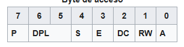

Ahora pasemos con las banderas siendo las siguientes:

- G: La bandera de granularidad indica el tamaño por el que se escala el valor límite. Si está limpio (0), el límite está en bloques de 1 byte (granularidad de byte). Si se establece (1), el límite está en bloques de 4 KiB (granularidad de página).

- DB: Bandera de talla. Si está claro (0), el descriptor define un segmento de modo protegido de 16 bits. Si se establece (1), define un segmento de modo protegido de 32 bits. Un GDT puede tener selectores de 16 y 32 bits a la vez.

- L:  Bandera de código de modo largo. Si se establece (1), el descriptor define un segmento de código de 64 bits. Cuando se ajusta, la base de datos siempre debe estar limpia. Para cualquier otro tipo de segmento (otros tipos de código o cualquier segmento de datos), debe quedar claro (0).

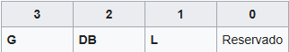

Ahora pasemos a los bytes de acceso. Esta tabla sirve para acceder y clasificar diferentes tupos de segmentos de codigo y datos. Son los siguientes:

- 0x1: TSS de 16 bits (Disponible)
- 0x2: LDT
- 0x3: TSS de 16 bits (Ocupado)
- 0x9: TSS de 32 bits (disponible)
- 0xB: TSS de 32 bits (Ocupado)

Tipo dispoible en modo largo:

- 0x2: LDT
- 0x9: TSS de 64 bits (Disponible)
- 0xb: TSS de 64 bits (Ocupado)

### 3.2.2 IDT
 
La Interrupt Descriptor Table (IDT) es una estructura de datos binaria específica de las arquitecturas IA-32 y x86-64. Es el equivalente en Modo Protegido y Modo Largo de la Interrupt Vector Table (IVT) del Modo Real, indicando a la CPU dónde se encuentran las rutinas de servicio de interrupción (ISR), una por cada vector de interrupción. Su estructura es similar a la de la Global Descriptor Table (GDT), por lo que conviene tener una GDT funcional antes de implementar la IDT.
 
Las entradas de la IDT se denominan "gates" (puertas), pudiendo ser Interrupt Gates, Task Gates o Trap Gates.
 
#### IDTR
 
La ubicación de la IDT se guarda en el registro IDTR (IDT register), que se carga mediante la instrucción de ensamblador LIDT, cuyo argumento es un puntero a una estructura de descriptor IDT:
 
- **Size**: un valor igual al tamaño de la IDT en bytes menos uno.
- **Offset**: la dirección lineal de la Interrupt Descriptor Table (no la dirección física, ya que se aplica paginación).
La cantidad de datos cargados por LIDT difiere entre modo de 32 bits y modo de 64 bits: el campo Offset ocupa 4 bytes en modo de 32 bits y 8 bytes en modo de 64 bits.
 
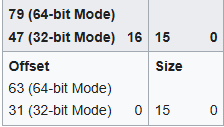
 
Esta estructura es similar a la GDT, salvo por las siguientes diferencias:
 
- En la IDT sí se utiliza la primera entrada (offset cero), a diferencia de la GDT.
- Existen 256 vectores de interrupción posibles (0..255), por lo que la IDT debería tener 256 entradas, cada una correspondiente a un vector concreto.
- Aunque la IDT puede contener más de 256 entradas, las adicionales son ignoradas.
- Aunque la IDT puede contener menos de 256 entradas, cualquier entrada no presente generará un fallo de protección general (General Protection Fault) si se intenta acceder a ella, por lo que lo ideal es que la tabla tenga suficientes entradas para poder manejar también ese propio fallo.
#### Estructura en IA-32 (32 bits)
 
**Tabla**
 
En procesadores de 32 bits, cada entrada de la IDT ocupa 8 bytes, formando una tabla en la que la entrada 0 se sitúa en `IDTR Offset + 0`, la entrada 1 en `IDTR Offset + 8`, y así sucesivamente hasta la entrada 255 en `IDTR Offset + 2040`.
 
La entrada correspondiente a un vector de interrupción dado se localiza en memoria escalando el vector por 8 y sumando el resultado al valor del campo Offset del IDTR.
 
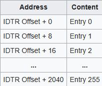
 
**Descriptor de puerta (Gate Descriptor)**
 
Cada entrada de la tabla tiene la siguiente estructura:
 
- **Offset**: un valor de 32 bits, dividido en dos partes. Representa la dirección del punto de entrada de la rutina de servicio de interrupción (ISR).
- **Selector**: un Segment Selector con varios campos, que debe apuntar a un segmento de código válido dentro de la GDT.
- **Gate Type**: un valor de 4 bits que define el tipo de puerta que representa este descriptor. Existen cinco valores válidos:
  - 0x5 (0b0101): Task Gate; en este caso el valor de Offset no se utiliza y debe fijarse a cero.
  - 0x6 (0b0110): Interrupt Gate de 16 bits.
  - 0x7 (0b0111): Trap Gate de 16 bits.
  - 0xE (0b1110): Interrupt Gate de 32 bits.
  - 0xF (0b1111): Trap Gate de 32 bits.
- **DPL (Descriptor Privilege Level)**: un valor de 2 bits que define los niveles de privilegio de CPU autorizados para acceder a esta interrupción mediante la instrucción `INT`. Las interrupciones hardware ignoran este mecanismo.
- **P (Present)**: bit de presencia. Debe estar activo (1) para que el descriptor sea válido.
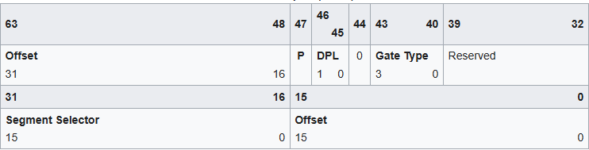
 
**Ejemplo de estructura en C**
 
```c
struct InterruptDescriptor32 {
   uint16_t offset_1;        // offset bits 0..15
   uint16_t selector;        // selector de segmento de código en la GDT o LDT
   uint8_t  zero;            // sin uso, fijar a 0
   uint8_t  type_attributes; // gate type, dpl y bit p
   uint16_t offset_2;        // offset bits 16..31
};
```
 
Valores habituales de `type_attributes` (asumiendo DPL=0):
 
- Interrupt Gate de 32 bits: `0x8E` (p=1, dpl=00, type=1110)
- Trap Gate de 32 bits: `0x8F` (p=1, dpl=00, type=1111)
- Task Gate: `0x85` (p=1, dpl=00, type=0101)
#### Estructura en x86-64 (64 bits)
 
**Tabla**
 
En procesadores de 64 bits, cada entrada de la IDT ocupa 16 bytes, situándose la entrada 0 en `IDTR Offset + 0`, la entrada 1 en `IDTR Offset + 16`, y así sucesivamente hasta la entrada 255 en `IDTR Offset + 4080`.
 
La entrada correspondiente a un vector de interrupción dado se localiza en memoria escalando el vector por 16 y sumando el resultado al valor del campo Offset del IDTR.
 
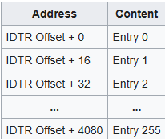
 
**Descriptor de puerta (Gate Descriptor)**
 
A diferencia de la GDT, donde cada entrada describe un segmento de memoria, cada entrada de la IDT describe una puerta hacia una rutina de servicio de interrupción. Sus campos son:
 
- **Offset**: un valor de 64 bits, dividido en tres partes, que combinadas representan la dirección del punto de entrada de la ISR.
- **Selector**: un Segment Selector que debe apuntar a un segmento de código válido dentro de la GDT.
- **IST (Interrupt Stack Table)**: un valor de 3 bits que actúa como desplazamiento dentro de la Interrupt Stack Table, almacenada en el Task State Segment (TSS). Si todos los bits están a cero, no se utiliza la Interrupt Stack Table.
- **Gate Type**: un valor de 4 bits. En modo largo solo existen dos valores válidos:
  - 0xE (0b1110): Interrupt Gate de 64 bits.
  - 0xF (0b1111): Trap Gate de 64 bits.
- **DPL**: igual que en IA-32, define los niveles de privilegio autorizados a acceder mediante `INT`.
- **P (Present)**: bit de presencia; debe estar activo (1) para que el descriptor sea válido.
- **Reservado**: 32 bits sin uso, deben permanecer a cero.
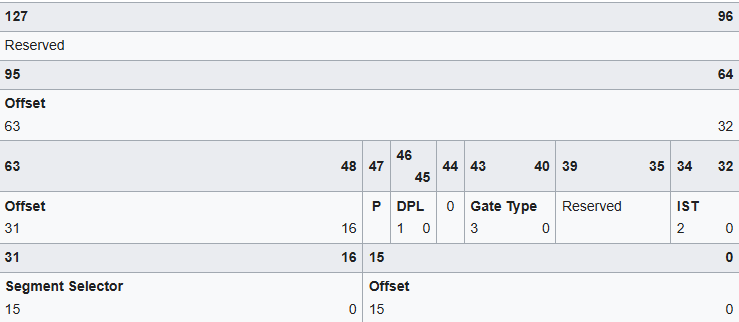
 
> En las rutinas de servicio de interrupción de 64 bits, el retorno debe realizarse con la instrucción `IRETQ` en lugar de `IRET`, ya que el ensamblador no realiza esa traducción automáticamente.
 
**Ejemplo de estructura en C**
 
```c
struct InterruptDescriptor64 {
   uint16_t offset_1;        // offset bits 0..15
   uint16_t selector;        // selector de segmento de código en la GDT o LDT
   uint8_t  ist;             // bits 0..2: desplazamiento en la Interrupt Stack Table, resto a 0
   uint8_t  type_attributes; // gate type, dpl y bit p
   uint16_t offset_2;        // offset bits 16..31
   uint32_t offset_3;        // offset bits 32..63
   uint32_t zero;            // reservado
};
```
 
Valores habituales de `type_attributes` (asumiendo DPL=0):
 
- Interrupt Gate de 64 bits: `0x8E` (p=1, dpl=00, type=1110)
- Trap Gate de 64 bits: `0x8F` (p=1, dpl=00, type=1111)
#### Vectores de interrupción reservados
 
Los primeros 32 vectores (0x00–0x1F) están reservados por la arquitectura x86 para excepciones del procesador; los vectores 0x20–0xFF quedan disponibles para interrupciones externas (hardware) y para uso del sistema operativo. La siguiente tabla resume los más relevantes:
 
| Vector (hex) | Vector (dec) | Mnemónico | Tipo | Código de error | Nombre | Origen |
|---|---|---|---|---|---|---|
| 0x00 | 0 | #DE | Fault | No | Divide Error | Instrucciones DIV e IDIV |
| 0x01 | 1 | #DB | Trap | No | Debug Exception | Breakpoints de instrucción, datos o E/S; single-step |
| 0x02 | 2 | NMI | Interrupt | No | NMI Interrupt | Interrupción externa no enmascarable |
| 0x03 | 3 | #BP | Trap | No | Breakpoint | Instrucción INT3 |
| 0x04 | 4 | #OF | Trap | No | Overflow | Instrucción INTO |
| 0x05 | 5 | #BR | Fault | No | BOUND Range Exceeded | Instrucción BOUND |
| 0x06 | 6 | #UD | Fault | No | Invalid Opcode | Opcode inválido o reservado |
| 0x07 | 7 | #NM | Fault | No | Device Not Available | Instrucción de coma flotante o WAIT/FWAIT |
| 0x08 | 8 | #DF | Abort | Sí (cero) | Double Fault | Cualquier instrucción que pueda generar una excepción, NMI o INTR |
| 0x0A | 10 | #TS | Fault | Sí | Invalid TSS | Cambio de tarea o acceso al TSS |
| 0x0B | 11 | #NP | Fault | Sí | Segment Not Present | Carga de registros de segmento o acceso a segmentos de sistema |
| 0x0C | 12 | #SS | Fault | Sí | Stack-Segment Fault | Operaciones de pila y carga de SS |
| 0x0D | 13 | #GP | Fault | Sí | General Protection | Cualquier referencia a memoria u otra comprobación de protección |
| 0x0E | 14 | #PF | Fault | Sí | Page Fault | Cualquier referencia a memoria |
| 0x10 | 16 | #MF | Fault | No | x87 FPU Floating-Point Error | Instrucción x87 FPU o WAIT/FWAIT |
| 0x11 | 17 | #AC | Fault | Sí (cero) | Alignment Check | Referencia a datos en memoria |
| 0x12 | 18 | #MC | Abort | No | Machine Check | Dependiente del modelo de CPU |
| 0x13 | 19 | #XM | Fault | No | SIMD Floating-Point Exception | Instrucciones SSE/SSE2/SSE3 |
| 0x14 | 20 | #VE | Fault | No | Virtualization Exception | Violaciones de EPT |
| 0x15 | 21 | #CP | Fault | Sí | Control Protection Exception | Instrucciones RET, IRET, RSTORSSP, SETSSBSY (con CET habilitado) |
| 0x16–0x1F | 22–31 | — | — | — | Reservado | Reservado para futuros vectores de excepción de CPU |
| 0x20–0xFF | 32–255 | — | Interrupt | No | — | Interrupciones externas |
 
#### Tipos de puerta (Gate Types)
 
Existen, a grandes rasgos, dos clases de interrupciones: las que se producen por una excepción derivada de código incorrecto, y las que ocurren para gestionar eventos ajenos al código en ejecución. En el primer caso interesa guardar la dirección de la instrucción que falló para poder reintentarla (son las llamadas **Traps**); en el segundo, interesa guardar la dirección de la siguiente instrucción para reanudar la ejecución donde se dejó (esto puede deberse a una IRQ, a otro evento hardware, o al uso de la instrucción `INT`). Además, durante un Trap pueden producirse nuevas interrupciones, mientras que durante el servicio de una IRQ las nuevas interrupciones quedan enmascaradas hasta enviar una señal de End of Interrupt. El comportamiento depende del tipo de puerta indicado en la entrada de la IDT.
 
- **Interrupt Gate**: se usa para especificar una rutina de servicio de interrupción. Al disparar la interrupción, la CPU localiza la entrada correspondiente en la IDT, carga el Selector y el Offset de la puerta y llama a la ISR. Al ejecutar `IRET` (o `IRETQ` en 64 bits) la CPU retorna de la interrupción. Las interrupciones se deshabilitan automáticamente al entrar y se reactivan al retornar.
- **Trap Gate**: pensada para gestionar excepciones. En ocasiones puede haber un código de error colocado en la pila, que debe extraerse antes de retornar de la interrupción. Estructuralmente es idéntica al Interrupt Gate, salvo que no deshabilita las interrupciones automáticamente al entrar.
- **Task Gate**: tipo de puerta específico de IA-32, usado para el cambio de tarea por hardware. El campo Selector debe apuntar a una posición de la GDT que especifique un Task State Segment (no un segmento de código), y el campo Offset no se utiliza. En lugar de saltar a una rutina de servicio, la CPU realiza un cambio de tarea hardware a la tarea especificada. Este tipo de puerta apenas se usa en la actualidad, ya que el cambio de tarea por hardware es lento y los procesadores modernos lo optimizan poco; además, ha sido eliminado por completo en x86-64.

### 3.2.3 MSR

Un registro específico del modelo ( MSR ) es cualquiera de los diversos registros de control en la arquitectura del sistema x86 que se utilizan para la depuración , el seguimiento de la ejecución del programa, la supervisión del rendimiento y la activación/desactivación de ciertas funciones de la CPU. Su funcionalidad principa es  configurar aspectos relevantes del sistema operativo, como el tipo y rango de memoria, sysenter/sysexit, APIC local...

El uso de este resgisto es la gestión de las intrucciones rdmsr y wrmsr, pues son instrucciones que solo el SO puede hacerla. 

rdmsry wrmsrson instrucciones privilegiadas. Sin embargo, existen algunos registros de memoria principal (MSR) a los que se puede acceder desde código no privilegiado mediante instrucciones especiales. Por ejemplo, la rdtscinstrucción es una instrucción no privilegiada que lee el contador de marca de tiempo, que en realidad se encuentra en un MSR 

## 3.2.3 SSDT

Es una matri de direcciones a ruinas del nucleo del sistama en 32 bits pero una de desplazamientos realtivas, a las mismas rutinas, en 64 bits.

La estrcutra de esta es la siguiente

```
typedef struct tagSERVICE_DESCRIPTOR_TABLE {
    SYSTEM_SERVICE_TABLE nt; //effectively a pointer to Service Dispatch Table (SSDT) itself
    SYSTEM_SERVICE_TABLE win32k;
    SYSTEM_SERVICE_TABLE sst3; //pointer to a memory address that contains how many routines are defined in the table
    SYSTEM_SERVICE_TABLE sst4;
} SERVICE_DESCRIPTOR_TABLE;

```
Un ejemplo que poner red teams notes es el siguiente

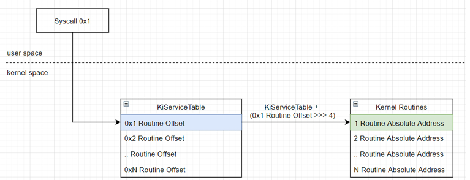

En este ejemplo se muestra como es una tabala de acceso a API criticas del sistema.. Es decir, es una estructura puente desde la llamada usuario hasta las operaciones de kernel. Esto se ve que si se llega a manipular esta estructura, es capaz de cambiar funciones o que vayan a direcciones no deseadas.  La forma de calcular las direcciones es la siguiente:

```
Rutina Dirección absoluta​​​​​​​​​​​​​=Dirección de la mesa de servicio de Ki​​​​​​+( rutina Desplazamiento​​​​​​​>>>4 )
```
## 3.2.4 Resto de estrucutras 

PatchGuard supervisa diversas estructuras internas del núcleo cuya modificación podría comprometer la integridad del sistema. Entre ellas se encuentran las pilas de ejecución del kernel, determinadas variables globales utilizadas por el núcleo, listas enlazadas y otros objetos internos empleados por el planificador, el gestor de memoria y el administrador de procesos. Asimismo, PatchGuard protege sus propios contextos de ejecución y datos internos, dificultando que un atacante deshabilite o modifique el propio mecanismo de protección. El conjunto exacto de estructuras monitorizadas no es público y ha variado entre las distintas versiones de Windows, ampliándose progresivamente para cubrir nuevos vectores de ataque descubiertos por la comunidad de investigación.

### 3.3. Modelo de funcionamiento asíncrono
> Ejecución en Ring 0, comprobaciones periódicas e impredecibles, BSOD con CRITICAL_STRUCTURE_CORRUPTION (0x109).

KPP funciona de forma asincrona, siendo esto un problema pues, para su analisis, no se sabe cuandoo va a hacer la comprobación de las estructuras. Suele tener una ejecución intermitente, sin saber muy bien cuando se activará. Ahora veamos con mayor detenimiento el error que da el error.

La comprobación de errores CRITICAL_STRUCTURE_CORRUPTION tiene un valor de 0x00000109. Esto indica que el kernel ha detectado daños críticos en el código de kernel o datos.

La tabla con que significa cada parametro

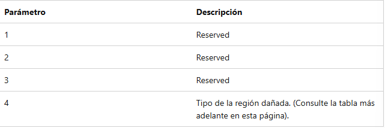

Y ahora en el parametro 4, puede tener uno de los siguientes significados

| Parámetro 4 | Tipo de corrupción detectada |
|-------------|------------------------------|
| `0x00` | Región de datos genérica |
| `0x01` | Modificación de función |
| `0x02` | Modificación de la Interrupt Descriptor Table (IDT) |
| `0x03` | Modificación de la Global Descriptor Table (GDT) |
| `0x04` | Corrupción de la lista de procesos (Tipo 1) |
| `0x05` | Corrupción de la lista de procesos (Tipo 2) |
| `0x06` | Modificación de rutina de depuración |
| `0x07` | Modificación crítica de MSR |
| `0x08` | Corrupción de tipo de objeto |
| `0x09` | Modificación de la Interrupt Vector Table (IVT) |
| `0x0A` | Modificación de una System Service Function (SSDT) |
| `0x0B` | Región de datos de sesión genérica |
| `0x0C` | Modificación de una función de sesión o `.pdata` |
| `0x0D` | Modificación de la Import Address Table (IAT) |
| `0x0E` | Modificación de la IAT de sesión |
| `0x0F` | Modificación de la llamada PsWin32 |
| `0x10` | Modificación de rutina del depurador |
| `0x11` | Modificación del asignador IRP |
| `0x12` | Modificación del despachador de llamadas del driver |
| `0x13` | Modificación del despachador de finalización de IRP |
| `0x14` | Modificación del liberador de IRP |
| `0x15` | Modificación de registro de control del procesador (CRx) |
| `0x16` | Modificación del registro de control de punto flotante |
| `0x17` | Modificación del Local APIC |
| `0x18` | Modificación de callback del kernel |
| `0x19` | Modificación de la lista de módulos cargados |
| `0x1A` | Corrupción de la lista de procesos (Tipo 3) |
| `0x1B` | Corrupción de la lista de procesos (Tipo 4) |
| `0x1C` | Corrupción del objeto DRIVER_OBJECT |
| `0x1D` | Modificación de callback ejecutiva |
| `0x1E` | Modificación del relleno de módulos |
| `0x1F` | Modificación de un proceso protegido |
| `0x20` | Región de datos genérica |
| `0x21` | Discrepancia de hash de página |
| `0x22` | Discrepancia de hash de página de sesión |
| `0x23` | Modificación del directorio de configuración de carga |
| `0x24` | Modificación de la tabla de funciones invertidas |
| `0x25` | Modificación de la configuración de sesión |
| `0x26` | Modificación de registro de control extendido (XCR) |
| `0x27` | Corrupción de grupo (Tipo 1) |
| `0x28` | Corrupción de grupo (Tipo 2) |
| `0x29` | Corrupción de grupo (Tipo 3) |
| `0x101` | Corrupción de grupo genérica |
| `0x102` | Modificación de `win32k.sys` |

La estrucuctura intera o depurandolo, debería de verse algo tal que así

```
CRITICAL_STRUCTURE_CORRUPTION (109)

Arg1: a39fd14fbbcc1122
Arg2: b3b72f4ea14d0001
Arg3: 0000000000000000
Arg4: 0000000000000002

```
## 4. Internals: inicialización y mecanismos internos

Ahora entremos en el último apartado, un analsis de KPP para ver como es su funcionamiento interno. 

### 4.1. Localización de la rutina de inicialización
.

Según algunos informes revisados, el blog de Satoshi Tanda me ha parecido interesante y como explica el metodo para el analisis de KPP.

Las dificultades principales que hay para el analisis de este son los siguietnes:

- Las funciones relacionadas con PatchGuard no tienen nombres descriptivos o no tienen nombres en absoluto, a diferencia de otras funciones del núcleo, a diferencia de otras funciones del núcleo
- La mayoría de las llamadas a funciones en funciones de PatchGuard son llamadas indirectas como el código C++
- La depuración del kernel no es una opción en algunas situaciones
- El código se copia en ubicaciones aleatorias y se almacena en forma cifrada, y no puedes detectar fácilmente dónde monitorizar en tiempo de ejecución

Con lo cual, si estas familiarizado con el reversing, es el dia a día estas complicaciones. Con lo que no están tanto en el tema, se les recomienda los siguientes consejos

- Identificación de funciones de PatchGuard
    - Localización de una función de inicialización y comprobación de referencias cruzadas
    - Nombrar funciones de manera consistente
- Análisis 0x109 volcado de bloqueo para reconstruir el contexto de PatchGuard
    - Diseccionar parámetros de comprobación de errores
    - Aplicación del formato del contexto a IDA
- Descubriendo hilos ejecutando código PatchGuard
    - Encontrar hilos del sistema en memoria

La funciión de iniaciliación se puede encontrar facilmente ordenando las funciones por longitud, pues es la más larga debido a la gran cantidad de variables a inicializar. Se recomienda cambiar el nombre a alguna disntiguida como Pg_xInitializePatchGuard(). AUn con ello, el analisis estatico dura poco, como bien se mencinó antes, la mayoría son llamdas dinamicas como clla qwrod prt [rsi+250h]. Esto quiere deir que se require ejecutar o debuguear este programa. Lo malo de esto, es tiene el flag para detectar si está siendo debugueada, que se verá en el siguiente punto.


### 4.2. Comprobaciones iniciales


PatchGuard realiza múltiples comprobaciones durante su inicialización para determinar si debe activarse:

```
// Verificación inicial en PgInitialization()
v2 = KdDisableDebugger();
KeKeepData(KiFilterFiberContext);
_disable();

if (!(_BYTE)KdDebuggerNotPresent) {
    while (1) ;  // Bucle infinito si hay depurador
}
_enable();
```
- KdDebuggerNotPresent: Variable global que indica si hay un depurador conectado
- KdPitchDebugger: Controla si se debe omitir la depuración
-  KdDisableDebugger(): Intenta deshabilitar cualquier depurador activo

Condiciones de desactivación:

- Modo seguro activo (InitSafeBootMode)
- Depurador del kernel conectado
- Integridad del sistema comprometida
- Fallos en la inicialización del contexto (con un debugue pordemos saltarnos la comporbación si se hace a tiempo)


### 4.3. Ofuscación de contextos y nombres de símbolos engañosos
Según analisis previos de este software se han encontrado las sigueintes metodolgías para ofuscar u oscurecer el código sin altos costes.

- Nombres de simbolos engañosos

```
// Ejemplo similar a nt!KiDivide6432 (paper 2005)
__int64 __fastcall CmpAppendDllSection(_QWORD *a1, __int64 a2)
{
    // Función que parece relacionada con el registro de DLLs
    // pero en realidad se usa para cifrado de contextos
}
```

- Cifrado XOR de contextos (DisPG)

```
// Descifrado del contexto mediante XOR con clave aleatoria
*a1 ^= a2;
a1[1] ^= a2;
a1[2] ^= a2;
a1[3] ^= a2;
a1[4] ^= a2;
a1[5] ^= a2;
// ... Continúa con 16+ iteraciones
```

- Uso de KiWaitAlways y kiWaitNever
```
// Variables globales utilizadas para codificar/decodificar punteros
KiWaitAlways  // Valor constante para ofuscación
KiWaitNever   // Valor complementario
```
- Generación de valores aleatorios

```
// Generación de valores pseudoaleatorios para ofuscación
v3 = __rdtsc();
v4 = (__ROR8__(v3, 3) ^ v3) * (unsigned __int128)0x7010008004002001uLL;
v5 = ((unsigned __int64)v4 ^ *((_QWORD *)&v4 + 1)) % 0xA;
```

### 4.4. Cadena de notificación de fallos


Hablaremos en este punto sobre la cadena de notifación de fallos siendo estos:

- KeBugCheckEx: es el nivel intermedio que prepara el contexto de la CPU antes de pasar al bugcheck final. Captura el estado del procesador y establece el contexto de la excepción.
```
void __stdcall __noreturn KeBugCheck(ULONG BugCheckCode)
{
    ULONG_PTR v1; // rdx
    ULONG_PTR v2; // r8
    ULONG_PTR v3; // r9
    ULONG_PTR v4; // [rsp+20h] [rbp-8h]
    
    KeBugCheckEx(BugCheckCode, v1, v2, v3, v4);
}
```
- KeBugCheck2: es el punto de entrada más simple para iniciar un bugcheck del sistema. Actúa como un wrapper que llama a KeBugCheckEx con parámetros sin inicializar.

```
void __stdcall __noreturn KeBugCheckEx(
    ULONG BugCheckCode,
    ULONG_PTR BugCheckParameter1,
    ULONG_PTR BugCheckParameter2,
    ULONG_PTR BugCheckParameter3,
    ULONG_PTR BugCheckParameter4)
{
    _disable();
    RtlCaptureContext(KeGetCurrentPrcb()->Context);
    KiSaveProcessorControlState(&KeGetCurrentPrcb()->ProcessorState);
    
    // Preparación del contexto para el bugcheck
    Context->Rcx = var_BugCheckCode;
    Context->Rip = (unsigned __int64)v7;
    Context->Rsp = (unsigned __int64)v6;
    
    KeBugCheck2(var_BugCheckCode, ...);
}
```
- KeBugCheckWithTf:  es la implementación principal que maneja el bugcheck. Realiza el análisis del error, identifica el driver culpable, muestra la BSOD (Blue Screen of Death) y reinicia el sistema.

```
DECLSPEC_NORETURN
VOID NTAPI KeBugCheckWithTf(
    IN ULONG BugCheckCode,
    IN ULONG_PTR BugCheckParameter1,
    IN ULONG_PTR BugCheckParameter2,
    IN ULONG_PTR BugCheckParameter3,
    IN ULONG_PTR BugCheckParameter4,
    IN PKTRAP_FRAME TrapFrame)
{
    // Guardar estado del sistema
    KeBugCheckActive = TRUE;
    KiBugCheckDriver = NULL;
    
    // Capturar contexto de la CPU
    RtlCaptureContext(&Prcb->ProcessorState.ContextFrame);
    KiSaveProcessorControlState(&Prcb->ProcessorState);
    
    // Procesar diferentes tipos de bugcheck
    switch (BugCheckCode) {
        case PAGE_FAULT_IN_NONPAGED_AREA:
            // Manejar fallo de página
            break;
        case IRQL_NOT_LESS_OR_EQUAL:
            // Manejar IRQL incorrecto
            break;
        // ... más casos
    }
    
    // Mostrar BSOD y manejar depuración
    KiDisplayBlueScreen(MessageId, ...);
    
    // Reiniciar o detener ejecución
    HalReturnToFirmware(HalRebootRoutine);
}
```

## 5. Evolución histórica de las técnicas de bypass

Ahora veamos resumiadmente los bypass que han habido a lo largo de la historia

### 5.1. 2005 — skape & Skywing: el paper fundacional


En el paper que sirve como referente a bypass nos dan tecnicas para hacer bypass. Ya tiene sus años pero a dia de hoy, sigue siendo un referente en este tema. En el paper se habla de 5 tecnicas

-  Exception Handler Hooking
-  KeBugCheckEx Hook
-  Finding the Timer
-  Hybrid Interception
-  Simulated Hot Patching

### 5.1.1 Exception Handler Hooking

Interceptar la ejecución de PatchGuard antes de que realice las verificaciones, modificando los manejadores de excepciones de los DPCs.

El funcionamiento es el siguiente:

- Un DPC con DeferredContext apuntando a un puntero inválido (XORed)
- El DPC provoca una General Protection Fault (#GP)
- El manejador de excepciones asociado ejecuta el código real de verificación

La implementación asociada es la siguiente:

```
// 1. Localizar el array de rutinas DPC (después del pool tag array)
// Buscar: "AcpSFileIpFIIrp MutaNtFsNtrfSemaTCPc"
for (Offset = 0; !DpcRoutines; Offset += 4) {
    if (memcmp(NtBaseAddress + Offset, CurrentFakePoolTagArray, ...) == 0)
        DpcRoutines = (PVOID *)(NtBaseAddress + Offset + sizeof(...) + 3);
}

// 2. Para cada DPC routine, extraer su exception handler
Function = RtlLookupFunctionEntry((ULONG64)DpcRoutines[Offset], ...);
UnwindBuffer = (PCHAR)(ImageBase + Function->UnwindData);
HandlerOffset = *(PULONG)(UnwindBuffer + 3 + (CodeCount * 2) + 20) & ~3;
HandlerAddress = (PCHAR)(ImageBase + HandlerOffset);

// 3. Parchear el handler para que solo retorne 1
// Instrucciones: push 1; pop eax; ret
InterlockedExchange((PLONG)LockedAddress, 0xc358016a);
```
### 5.1.2  KeBugCheckEx Hook

Interceptar después de que PatchGuard detecte una violación, evitando que el sistema se bloquee.

PatchGuard siempre reporta violaciones llamando a KeBugCheckEx con el código 0x109 (CRITICAL_STRUCTURE_CORRUPTION). El objetivo es el siguiente:

- Detectar la llamada con código 0x109
- Reiniciar el thread worker en lugar de dejar que el sistema crashée
- Permitir que el sistema continúe funcionando

La implementación asociada es al siguiente:

```
// 1. Hook de KeBugCheckEx
VOID KeBugCheckExHook(ULONG BugCheckCode, ...) {
    if (BugCheckCode != 0x109) {
        // Llamar al original para otros bugchecks
        OrigKeBugCheckEx(...);
    } else {
        // Obtener el thread actual y su StartRoutine
        CurrentThread = PsGetCurrentThread();
        StartRoutine = *(PVOID **)(CurrentThread + ThreadStartRoutineOffset);
        StackPointer = IoGetInitialStack();
        
        // Reiniciar el thread worker
        AdjustStackCallPointer(StackPointer - 0x8, StartRoutine, NULL);
    }
}

// 2. Assembly stub para ajustar el stack
AdjustStackCallPointer PROC
    mov rsp, rcx      ; Nuevo stack pointer
    xchg r8, rcx      ; Argumento para el thread
    jmp rdx           ; Saltar a StartRoutine
AdjustStackCallPointer ENDP

// 3. Patch de KeBugCheckEx (primeros 15 bytes)
HookStub = "\x48\xb8\x41\x41\x41\x41\x41\x41\x41\x41\xff\xe0"
// mov rax, [KeBugCheckExHook]
// jmp rax

// 4. Encontrar offset de StartRoutine en ETHREAD
for (offset = 0; offset < 0x1000; offset += 4) {
    if (*(PVOID **)(CurrentThread + offset) == DisablePatchProtectionSystemThreadRoutine)
        break;  // Encontrado
}

```


### 5.1.3  Finding the Timer

Localizar y cancelar el timer que ejecuta la rutina de verificación de PatchGuard.

El fundamento es el siguiente:

- DeferredRoutine apuntando a una de 3 rutinas conocidas
- DeferredContext apuntando a un puntero inválido
- Offset 0x88 conteniendo el valor 0x1131 (primeros bytes de CmpAppendDllSection)

La función usada para la busqeda es el siguiente:

```
// Criterios de búsqueda:
// 1. DeferredRoutine en {KiScanReadyQueues, ExpTimeRefreshDpcRoutine, ExpTimeZoneDpcRoutine}
// 2. DeferredContext es un puntero inválido
// 3. Timer->Unknown[0x88] == 0x1131
// 4. Está en NonPagedPool

for (each address in NonPagedPool) {
    if (IsValidTimerStructure(address)) {
        // Verificar criterios
        if (IsDeferredRoutinePatchGuard(addr->DeferredRoutine) &&
            IsInvalidPointer(addr->DeferredContext) &&
            *(PWORD)(addr + 0x88) == 0x1131) {
            // Encontrado - cancelar timer
            KeCancelTimer(addr);
            break;
        }
    }
}

```

### 5.1.4  Hybrid Interception 

Combinar las técnicas de before-the-fact y after-the-fact para una detección más robusta.

### 5.1.5  Simulated Hot Patching

Utilizar el mecanismo legítimo de hot-patching de Microsoft para engañar a PatchGuard.

El fundamento es:

- PatchGuard permite hot-patching oficial a través de la API de Microsoft. Si se puede simular un hot-patch legítimo, PatchGuard no detectará la modificación.

### 5.2. 2017 — GhostHook (abuso de Intel PT)
GhostHook es una técnica desarrollada por investigadores de CyberArk Labs en 2017 que permite bypassear PatchGuard en sistemas Windows 64-bit mediante la explotación de Intel Processor Trace (IPT). IPT permite:

- Capturar información de ejecución de software
- Monitoreo de rendimiento
- Depuración y análisis de código
- Análisis de malware

El mecanismo de ataque usado es el siguiente:

### Paso 1: Asignación de Buffer Pequeño
El atacante asigna **buffers extremadamente pequeños** para los paquetes de Intel PT.

### Paso 2: Inicio del Tracing
Se inicia el tracing de Intel PT para monitorear **regiones críticas del kernel**.

### Paso 3: Overflow y PMI Handler
- El buffer se llena rápidamente
- La CPU fuerza la apertura de un **Performance Monitoring Interrupt (PMI) handler**
- El PMI handler es **código controlado por el atacante**

### Paso 4: Inyección del Rootkit
El PMI handler se ejecuta en el **contexto del hilo que está siendo trazado**, permitiendo:
- Modificar el flujo de ejecución
- Inyectar el rootkit


### 5.3. 2019 — InfinityHook 
InfinityHook es una técnica desarrollada por **everdox** que permite hookear llamadas al sistema, cambios de contexto, fallos de página y más, operando **junto a PatchGuard y VBS/Hyperguard** de manera sigilosa y portable en todas las versiones de Windows 7 a Windows 10.

#### Mecanismo

InfinityHook se basa en la manipulación de **ETW (Event Tracing for Windows)**, específicamente explotando la sesión del **proveedor de trazas del sistema** (`SystemTraceProvider`).

1.  **Contexto de ETW**: Cada sesión activa de logger se almacena en un array de estructuras `_WMI_LOGGER_CONTEXT`. InfinityHook localiza este array mediante una firma de 5 bytes (`0x2c, 0x08, 0x04, 0x38, 0x0c`) que es estable a través de versiones.
2.  **Punto de Hook**: Dentro de la estructura `_WMI_LOGGER_CONTEXT`, en el offset `+0x28`, se encuentra el puntero a función `GetCpuClock`, que puede apuntar a `EtwGetCycleCount`, `EtwpGetSystemTime` o `PpmQueryTime`. InfinityHook **sobrescribe este puntero** con una rutina personalizada.
3.  **Configuración**: Se hijackea la sesión del logger de contexto del kernel (siempre activa por defecto) y se configura para que registre únicamente llamadas al sistema en un buffer de memoria circular.
4.  **Captura y Redirección**: Cuando se ejecuta una syscall, la rutina hookeada es invocada. El código recorre la pila para encontrar el número de la syscall y el puntero a la función objetivo que `KiSystemCall64` ha guardado en la pila. Este puntero puede ser sobrescrito para redirigir la ejecución a una función personalizada, permitiendo monitorizar o filtrar los argumentos de la llamada.

#### Uso

El proyecto proporciona una biblioteca (`libinfinityhook`) que simplifica su uso. El desarrollador solo debe llamar a `IfhInitialize` pasando un callback, que recibirá el índice de la syscall y un puntero a la función que puede ser modificado.


### 5.4. 2019 —  ByePg

ByePg es una técnica de bypass de PatchGuard, desarrollada por **Can Bölük**, que explota el hookeo de **manejadores de excepciones** en modo kernel, específicamente mediante la manipulación de la tabla `HalPrivateDispatchTable` durante el proceso de bugcheck.

#### Mecanismo

El ataque se basa en la cadena de ejecución cuando ocurre una excepción crítica que lleva a un bugcheck.

1.  **Flujo de Excepción**: Cuando ocurre una excepción en modo kernel, el control pasa a `KiExceptionDispatch` (o `KiBugCheckDispatch`), que a su vez llama a `KiDispatchException`. Si no hay un manejador SEH, se llama a `KeBugCheckEx`.
2.  **Dentro de KeBugCheckEx**: Esta función prepara el contexto, deshabilita interrupciones, guarda el estado del procesador y finalmente llama a `KeBugCheck2`.
3.  **Explotación**: `KeBugCheck2` en versiones modernas (Windows 8/8.1/10) realiza llamadas a funciones a través de punteros almacenados en la tabla `HalPrivateDispatchTable`. Específicamente, llama a:
    - `HalTimerWatchdogStop` (si la versión de la tabla >= 23)
    - `HalPrepareForBugcheck` (si la versión >= 6)
4.  **Hook**: Dado que `HalPrivateDispatchTable` reside en la sección `.data` y **no está protegida por PatchGuard**, un driver puede sobrescribir estos punteros para redirigir la ejecución a sus propias funciones.
5.  **Manejo del Bugcheck**: Los hooks personalizados (`HkHalTimerWatchdogStop` o `HkHalPrepareForBugcheck`) se ejecutan al inicio del bugcheck. Extraen el contexto de la excepción de los parámetros de `KeBugCheckEx`. Si la excepción es, por ejemplo, un `STATUS_BREAKPOINT` (#BP), pueden **descartar el bugcheck**, restaurar el contexto, limpiar las variables de estado (`KiBugCheckActive`, `KiHardwareTrigger`) y continuar la ejecución, permitiendo así que el sistema no se bloquee.
6.  **Concurrencia**: La técnica maneja el caso de múltiples procesadores entrando en bugcheck simultáneamente, utilizando la tabla `HalPrivateDispatchTable` de nuevo para gestionar el estado de congelación de la CPU (`HalNotifyProcessorFreeze`) y restaurar la ejecución en todos los núcleos.


## 6. HyperGuard / Secure Kernel Patch Guard: la respuesta a largo plazo


La aparición de HyperGuard, también denominado Secure Kernel Patch Guard (SKPG), representa la evolución natural de PatchGuard frente a las limitaciones de su diseño original. Aunque PatchGuard dificultó enormemente la modificación del núcleo de Windows, seguía compartiendo el mismo nivel de privilegio (Ring 0 o VTL0) que los controladores del sistema. En consecuencia, cualquier atacante que consiguiera ejecutar código arbitrario en modo kernel disponía, al menos teóricamente, del mismo nivel de privilegios que el propio mecanismo encargado de proteger el sistema.

Durante más de una década, gran parte de las investigaciones sobre bypass de PatchGuard explotaron precisamente esta limitación. En lugar de modificar directamente las estructuras protegidas, los atacantes centraban sus esfuerzos en localizar los contextos internos de PatchGuard, alterar sus temporizadores, interceptar las comprobaciones de integridad o evitar la llamada final a `KeBugCheckEx`. Cada nueva versión de Windows incorporaba nuevas técnicas de ofuscación y verificaciones adicionales, pero el problema fundamental permanecía inalterado: el atacante y PatchGuard seguían ejecutándose en el mismo dominio de confianza.

Microsoft comenzó a abordar esta limitación con la introducción de **Virtualization-Based Security (VBS)**, incorporada inicialmente en Windows 10 y ampliada en versiones posteriores. VBS aprovecha las extensiones de virtualización hardware (Intel VT-x y AMD-V) para crear distintos niveles de confianza denominados **Virtual Trust Levels (VTL)**.

Los dos niveles relevantes son:

- **VTL0**: donde continúa ejecutándose el kernel tradicional de Windows (`ntoskrnl.exe`), junto con los drivers convencionales.
- **VTL1**: un entorno aislado y protegido por el hipervisor donde se ejecuta el denominado **Secure Kernel (`SecureKernel.exe`)**, inaccesible para cualquier código que únicamente disponga de privilegios de kernel tradicionales.

Esta separación supone un cambio de paradigma respecto al modelo de seguridad anterior. En lugar de confiar exclusivamente en mecanismos software ejecutándose en Ring 0, parte de la verificación de integridad pasa a realizarse desde un entorno situado por encima del propio kernel convencional.

Dentro de este nuevo modelo aparece **Secure Kernel Patch Guard (SKPG)**, conocido habitualmente como **HyperGuard**. Aunque mantiene el mismo objetivo que PatchGuard —garantizar la integridad de estructuras críticas del sistema—, traslada parte de sus comprobaciones al Secure Kernel. Muchas de las funciones internas asociadas a este mecanismo utilizan el prefijo `Skpg`, diferenciándose claramente de las funciones clásicas implementadas por PatchGuard dentro de `ntoskrnl.exe`.

Esta arquitectura presenta varias ventajas importantes frente al diseño original:

- El código que realiza las comprobaciones de integridad ya no reside únicamente en el kernel convencional.
- Un controlador malicioso ejecutándose en VTL0 no puede modificar directamente la memoria protegida perteneciente a VTL1.
- Las estructuras utilizadas por SKPG permanecen aisladas mediante el hipervisor, dificultando enormemente su localización mediante técnicas tradicionales de ingeniería inversa.
- Los contextos internos dejan de compartir completamente el mismo espacio de memoria que el atacante, eliminando uno de los principales puntos débiles explotados históricamente por los bypasses de PatchGuard.

Como consecuencia, muchas técnicas clásicas dejan de ser aplicables. Métodos como la modificación de temporizadores internos, la manipulación de los contextos cifrados de PatchGuard o la interceptación de determinadas rutas de ejecución dejan de ser suficientes cuando las comprobaciones se realizan desde VTL1. Para evadir HyperGuard ya no basta con comprometer el kernel tradicional: el atacante debe vulnerar también el modelo de aislamiento impuesto por el hipervisor, un escenario considerablemente más complejo.

No obstante, HyperGuard no sustituye completamente a PatchGuard. Ambos mecanismos coexisten y se complementan. PatchGuard continúa supervisando numerosas estructuras dentro de `ntoskrnl.exe`, mientras que HyperGuard añade una segunda capa de protección ejecutándose desde un dominio de confianza superior. Esta estrategia de defensa en profundidad reduce significativamente la superficie de ataque y dificulta que un único fallo permita comprometer completamente la integridad del sistema.

En términos prácticos, HyperGuard ha elevado notablemente el coste de desarrollar bypasses funcionales. Mientras que durante los primeros años de PatchGuard aparecieron numerosas investigaciones capaces de neutralizar temporalmente sus mecanismos internos, los trabajos recientes suelen centrarse en técnicas muy específicas o en escenarios donde VBS y HVCI se encuentran deshabilitados. En sistemas modernos con todas las mitigaciones activadas, los ataques deben dirigirse contra el propio hipervisor, vulnerabilidades hardware o fallos en componentes privilegiados, elevando considerablemente la complejidad técnica requerida.

Aunque ningún mecanismo de seguridad puede considerarse infalible, la incorporación de HyperGuard representa uno de los mayores avances en la protección del kernel desde la aparición de PatchGuard en 2005. La combinación de aislamiento mediante virtualización, separación de dominios de confianza y supervisión desde VTL1 ha conseguido corregir la principal debilidad del diseño original: proteger el kernel desde el mismo nivel de privilegio que el software potencialmente malicioso.
## 7. Conclusiones

Antes de su aparición, la modificación de estructuras críticas del kernel era una práctica habitual tanto en herramientas legítimas como en rootkits, lo que facilitaba la alteración del comportamiento del sistema. Con la introducción de Kernel Patch Protection (KPP), Microsoft estableció un nuevo modelo de seguridad basado en preservar la integridad del kernel e impedir este tipo de modificaciones.

Con la llegada de KPP como solución a este problema, se ha difcultado en mayor medida la alteración de las estrcuturas, debido a ser imprevisible como la constante revisión en sus mecanismos de protección.

A parte de esto, aunque si se mostró cadencias como los casos presentados, se ha ido reforzando, llegnado para apoyarle el VBS y el HyperGuard para reforzar más el sistema.

Para conclurir, KPP es una de las piezas claves de seguridad de windows, aunque haya abandonado la filosofía de ser un programa más de kernel 0 y comenzar a aislarse con sus nuevos acomplamientos como parches


## 8. Referencias

- Wikipedia (EN). *Kernel Patch Protection*. https://en.wikipedia.org/wiki/Kernel_Patch_Protection
- Wikipedia (ES). *Protección contra revisiones del núcleo*. https://es.wikipedia.org/wiki/Protecci%C3%B3n_contra_revisiones_del_n%C3%BAcleo
- Wikipedia (EN). *Microsoft Reserved Partition*. https://en.wikipedia.org/wiki/Microsoft_Reserved_Partition
- Grokipedia. *Kernel Patch Protection*. https://grokipedia.com/page/Kernel_Patch_Protection
- Uninformed Journal, vol. 8, artículo 5. *PatchGuard overview*. http://uninformed.org/index.cgi?v=8&a=5&p=2
- skape & Skywing. *Bypassing PatchGuard on Windows x64* (Uninformed, vol. 3, 2005). https://hick.org/code/skape/papers/bypassing-x64-patchguard.pdf

**Estructuras de bajo nivel (GDT / IDT / MSR / SSDT)**

- OSDev Wiki. *Interrupt Descriptor Table*. https://wiki.osdev.org/Interrupt_Descriptor_Table
- OSDev Wiki. *Global Descriptor Table*. https://wiki.osdev.org/Global_Descriptor_Table
- OSDev Wiki. *Model Specific Registers*. https://wiki.osdev.org/Model_Specific_Registers
- Red Team Notes. *System Service Descriptor Table - SSDT*. https://www.ired.team/miscellaneous-reversing-forensics/windows-kernel-internals/glimpse-into-ssdt-in-windows-x64-kernel

**Análisis interno y bug check 0x109**

- Tanda, S. *Some Tips to Analyze PatchGuard*. https://standa-note.blogspot.com/2015/10/some-tips-to-analyze-patchguard.html
- tandasat. *PgResarch / DisPG* (GitHub). https://github.com/tandasat/PgResarch
- Tetrane. *Updated Analysis of PatchGuard on Microsoft Windows 10 RS4*. https://blog.tetrane.com/downloads/Tetrane_PatchGuard_Analysis_RS4_v1.01.pdf
- Microsoft Learn. *Bug Check 0x109: CRITICAL_STRUCTURE_CORRUPTION*. https://learn.microsoft.com/es-es/windows-hardware/drivers/debugger/bug-check-0x109---critical-structure-corruption
- r0keb. *PatchGuard Internals* (2025). https://r0keb.github.io/posts/PatchGuard-Internals/

**Historia, controversia y contexto periodístico**

- BizTech Magazine (2007). *Windows Vista Kernel Patch Protection (a.k.a. PatchGuard)*. https://biztechmagazine.com/article/2007/02/windows-vista-kernel-patch-protection-aka-patchguard
- Cisco Talos Intelligence Blog. *The Windows 8.1 Kernel Patch Protection*. https://blog.talosintelligence.com/the-windows-81-kernel-patch-protection/
- The Record from Recorded Future News (2023). *PoC published for new Microsoft PatchGuard (KPP) bypass*. https://therecord.media/poc-published-for-new-microsoft-patchguard-kpp-bypass
- Outflank (2026). *PatchGuard Peekaboo: Hiding Processes on Systems with PatchGuard in 2026*. https://www.outflank.nl/blog/2026/01/07/patchguard-peekaboo-hiding-processes-on-systems-with-patchguard-in-2026/

**Técnicas de bypass (2017–2019)**

- TechTarget. *How does the GhostHook attack bypass Microsoft PatchGuard?*. https://www.techtarget.com/searchsecurity/answer/How-does-the-GhostHook-attack-bypass-Microsoft-PatchGuard
- GitHub. *InfinityHook*. https://github.com/everdox/InfinityHook
- GitHub. *ByePg*. https://github.com/can1357/ByePg

**Hyperguard**

Alex Ionescu. *Unknown Known DLLs and other Code Integrity Trust Violations*. Recon 2018.

Microsoft Learn. *Virtualization-based Security (VBS)*.
https://learn.microsoft.com/windows/security/hardware-security/enable-virtualization-based-protection-of-code-integrity

Microsoft Learn. *Hypervisor-protected Code Integrity (HVCI)*.
https://learn.microsoft.com/windows/security/hardware-security/hypervisor-protected-code-integrity

Microsoft Learn. *Kernel Data Protection (KDP)*.
https://learn.microsoft.com/windows/security/hardware-security/kernel-data-protection

Microsoft. *Windows Internals, Part 1 (7th Edition)*.
Pavel Yosifovich, Alex Ionescu, Mark Russinovich, David Solomon.

r0keb. *PatchGuard Internals* (2025).
https://r0keb.github.io/posts/PatchGuard-Internals/

Cisco Talos. *The Windows 8.1 Kernel Patch Protection*.
https://blog.talosintelligence.com/the-windows-81-kernel-patch-protection/

Tetrane. *Updated Analysis of PatchGuard on Windows 10 RS4*.
https://blog.tetrane.com/downloads/Tetrane_PatchGuard_Analysis_RS4_v1.01.pdf

Satoshi Tanda. *Some Tips to Analyze PatchGuard*.
https://standa-note.blogspot.com/2015/10/some-tips-to-analyze-patchguard.html

Skape & Skywing. *Bypassing PatchGuard on Windows x64*. Uninformed Journal, 2005.
https://hick.org/code/skape/papers/bypassing-x64-patchguard.pdf
